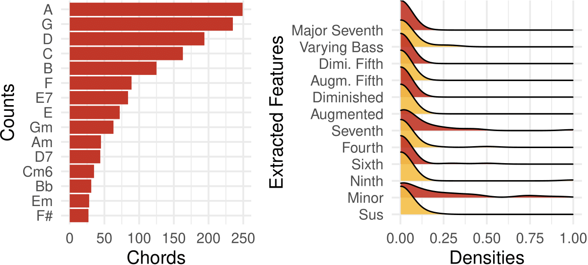
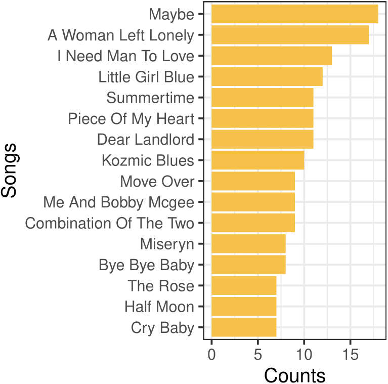
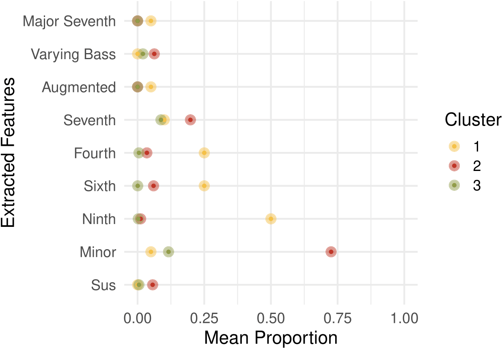

# Summary

The Music Information Retrieval research field, in general terms, 
is concerned with the extraction and inference of relevant features
from music. That can involve a big range of tasks, including 
music recommendation systems, analysis of music similarity 
and auto-tagging, automatic music recognition, artificial 
music composition, the relationship between music and the human behavior, and
many more. Though the field is still young, it has been experiencing a 
constant growth in the past few years  [@schedl2014music]. Considering 
that music is one of the most important cultural elements of our society
and the impact it can have in our daily lives, this expansion is not surprising.
Along with that, many software options for the analysis and
creating tools involving music data are arising, such as 
([@mcfee2015librosa], [@cuthbert2010music21], [@bock2016madmom],
[@manaris2014making], [@giannakopoulos2015pyaudioanalysis]), to name a few. 

However, given how broad MIR is, we are not even close to have 
all the possible tools and data that might be needed to perform specific
tasks. Currently, MIR is mostly limited to the use of `python`
[@van2007python], as can be perceived in the previous references to the software
available. This constraint raises an issue regarding the 
accessibility and democratization of the field, which gets compromised
by the fact that it demands knowledge in one very particular 
programming language. In addition, many MIR tasks are heavily related 
to statistics and machine learning, which, by their turn, hardly 
only focus in one primary programming language. 

Another issue is the predominant focus on audio data. It is true
that, with the increase of computation power,
being able to process the signal straight from audio has been responsible
for major improvements to the MIR research field, since audio data is 
exceptionally rich and informative. However, obtaining such music files 
can be very expensive due to rights-holders and copyright laws 
[@schedl2014music]. This has been a vital motivation for the
difficult task of creating publicly available datasets of audio 
and audio-related features, and also one of the main problems 
that the researchers in MIR face. A less painful option is the
use of symbolic data [@billard2006symbolic], which is comprised of 
digital representations of musical scores (MIDI, for example), with 
notes, timbre and pitch information, chords data, lyrics, and so on. 

The existence of these two issues are the main motivation for the
software proposed in this paper. The `chorrrds`
package is mostly dedicated to the extraction of music chords in `R` [@rmanual]. Along with the main functions, the package is  
is accompanied by useful functions and objects to help analyze the music
chords and inspire users in their research problems. The music chords 
are obtained via the web scraping 
[@webscraping] of the [Cifraclub website](https://www.cifraclub.com.br/),
an online collaborative Brazilian page of music-sharing. The website 
freely provides a big collection of music chords for different instruments,
and most of the chords information present there are contributions 
of the users.  The chords for any artist or band available on the
website can be extracted, as well as the results for the other
functions of the package. 

In the following, we exemplify the usage of the main and the auxiliary
functions and object of the package, as well as provide a few 
practical usage examples. 


# Main functions 

The `chorrrds` package is widely available through CRAN, the 
biggest repository of `R` packages. This makes its installation as simple as

```
R> install.packages("chorrrds")
```

that will retrieve and install the latest version available on CRAN.
After that, we can load and use the `get_chords()`
function, that depends on the results of the  `get_songs()` function. 
This is easily done with, for example

```
R> library(chorrrds)
R> artist <- "janis-joplin"
R> song_urls <- get_songs(artist)
R> song_chords <- get_chords(song_urls)
```

where the *song_urls* and the *song_chords* objects are both a
*tibble. The last is composed by 4 data columns:
*chord*, *key*, *song* and *artist*, which
represent, the chords collected (in temporal, but not necessarily
equally spaced, order), the song key as found on the website, the name
of the song and the name of the artist.  

We recommend the use of the `clean()` function always, that 
removes strange objects if they end up being retrieved
along with the chords, such as lyrics or other `html`
elements. This rarely happens, but if it does, 
it is better to prevent that it gets mixed with the chords data, 
with 

```
R> song_chords <- clean(song_chords)
```

Accompanying the main chords extraction function, we also provided
a few other functions to help analyze and wrangle the extracted 
data. The first one is the  `chords_ngram()`, that allows for the
creation of **n-grams** [@damashek1995gauging] 
for the sequences of chords. This is useful in the case where the
taks involves the patterns on the chords
transitions present in the data, which is frequent in 
harmony analysis. Chords transitions are informative about the
underlying harmonic structure present in songs, and it might serve
for comparing songs, analyzing selected pieces, or even a full
artist collection. The code for finding the n-grams is

```
R> jj_ngrams <- chorrrds::chords_ngram(song_chords, n = 2)
R> jj_ngrams[2, "chords_ngram"]
R> [1] "Dadd9 Dsus4/9"
```

The choice of *n*, or how many chords should be considered in 
each n-gram, will depend on the analysis being conducted, and
is set to 2 as default. 

Going further on the analysis tools provided, we have the 
`feature_extraction()` function, that calculates summary features 
from the chords dataset, indicating if each chord is:

  - minor, 
  - diminished,  
  - augmented, 
  - sus, 
  - chords with the 7th, 
  - chords with the major 7th, 
  - chords with the 6th, 
  - chords with the 4th, 
  - chords with the augmented 5th, 
  - chords with the diminished 5th,  
  - chords with the 9th, chords with varying bass 

Again, those are variables that are constructed in order 
to facilitate the harmonic structure analysis of the pieces. 
For instance, one can use the given variables to analyze the 
harmonic complexity of the songs regarding many different
levels. As for the code, it is only 

```
R> jj_features <- feature_extraction(song_chords)
R> jj_features[1, c(1, 6:17)]
R> chord minor dimi augm sus seventh seventh_M sixth fourth fifth_aug fifth_dim ninth bass
R> Dadd9     0    0    0   0       0         0     0      0         0         0     1    0
```


Added to the set of analysis functions, we put some auxiliary objects
in the package. For these cases, the choice of keeping them as objects 
instead of functions that use such objects is to give the user more
freedom about the operations they can perform using the objects. 
The `deg_maj` and `deg_min` objects are basically 
dataframes composed by the chords in all the 12 major and minor scales. To
give a brief explanation, a major scale is be defined by having the 
W–W–H–W–W–W–H note interval pattern 
(W = whole step, 2 semitones; H = half step, 1 semitone), 
starting in a certain note (as C, D, etc), and we can arguibly say 
that this is the most important scale structure in occidental music.
The minor scale is defined by the W-H-W-W-H-W-W structure, and it follows the major scale on the importance ranking. Similarly, 
its chords will be the ones starting in each of its notes, but now
Given that, the two mentioned
objects can help the user to transpose songs to different scales, 
since when we collect the chords, we also collect the key in which
the chords are. Both objects also contain a *degree* column, 
indicating which is the degree (I-II-III-IV-V-IV-V) of each chord 
in the scales. Coming back to harmonic analysis, much of what happens
in music structures are intrinsically related to the degrees of the 
chords used, as each degree plays a different role in the music structure. 
For example, some chords (or degrees), when followed by a specific one or 
another degree, can give the song a feeling of tension, or rest, 
depending on what the intention of the composer is. To use the 
objects, it is only a matter of calling it. Another interesting object 
present on the package is the `dist` dataframe, composed by 
the distances of each note by semitones and by steps in circle-of-fifths.

One of the most recent features added to the package is the possibility
of extracting lyrics and aligning them with the music chords. This is 
done by running, for example:

```
lyrics_chords <- create_dat(artist = artist, track = song_urls$song[1])
lyrics_chords <- create_net(lyrics_chords)
head(lyrics_chords)

R> chord lyric                           
R> G     will soon grow tired of waiting,
R> C     She’ll do crazy                 
R> G/    things                          
R> B     yeah,                           
R> D     on lonely                       
R> G     for the new men now and again  
```

where the chord column represents the chord played, 
and the lyric column represents the words being sung at each part of
the song. The new function opens up a whole new set of applications
for the package, once the relationship between chords/harmony and
music lyrics is one of the interests of the MIR community. 

# Example Analysis

This section is dedicated to giving a few concrete examples of what 
can be done using the `chorrrds` package. 

In Figure 1, we see the 15 most frequent chords in Janis Joplin's songs 
and the correspondent densities for the features extracted from her songs.
From these plots, we can have a better idea of the harmonic anatomy
of the songs. For instance, the two plots are evidencing that the
songs have mostly simple chords, with no alterations (such as added notes
or a different chord in the bass), and the minor chords can be quite
predominant. Besides that, some chords are clearly preferred by the
artist, as their frequencies are much higher than the less common
chords. 


{ width=70% }


As for Figure 2, continuing on the harmonic pattern exploration, 
we see 15 songs with the highest number of different chords. Though
a few chords have a high frequency, we still have songs with a considerable
number of different chords. With Figure 1, it could be argued that 
Janis Joplin's songs are harmonically simple, given their limitation to
a specific group of chords. Figure 2, on the other hand, 
comes with an opposite idea, showing that even having preferences by
some chords, the artist managed to create songs with a big variation
of chords, which is not an easy composition task. Of course, there are
many other details of the songs that are not being considered here, 
but that is already a big piece of information. 


{ width=30% }


In Figure 3, on the other hand, we present the results of a 
Gaussian Mixture clustering
analysis on the average of the features extracted 
by the `feature_extraction()` function. So the input of the clustering
is the proportion of each feature extracted from
the chords (minor, diminished, etc) for each Janis Joplin song. With
that, we try to verify if there exists a reasonable way of clustering
her songs using the extracted features. The plot shows us the average
of each of those features in each resulting cluster. 
In cluster 1, for example, 
the average proportion of the number of chords with the 4th note, the 
6th note and the 9th note are higher than in the other 2 clusters, 
implying that those 3 features might serve well to characterize a portion
of the songs. As for cluster 2, its big difference compared to the
other clusters is that its songs have a high proportion of minor chords, 
which is usually associated with more melancholic/sad songs, also
a perfectly plausible classification. Cluster 3 relates
to the most "basic" songs, that are limited to using
simpler versions of the chords. 


{ width=50% }


# Acknowledgements

We acknowledge contributions from Matthew Leonawicz and Luca Carbone, 
which have been essential for the improvement of this project. 

# References